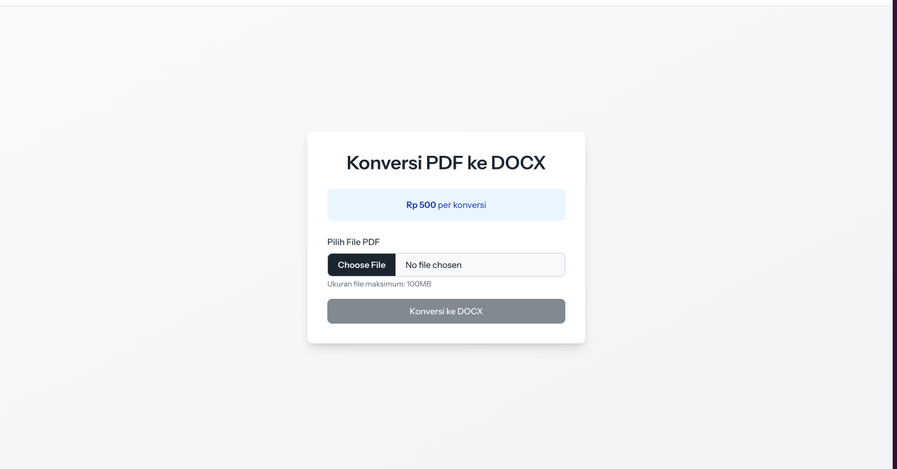
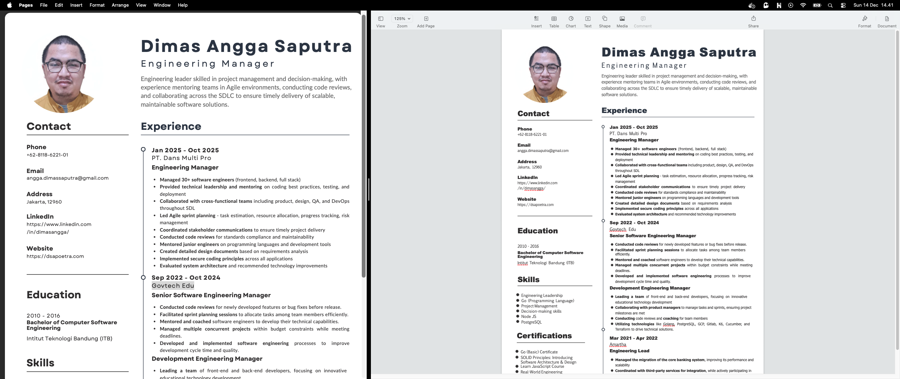

# Laravel PDF to DOCX Converter

A web application built with Laravel 12 and React that converts PDF files to DOCX format using the CloudConvert API. The application features a simple payment system for conversion services.

## Screenshots

### Converter Interface

*Main conversion interface with file upload and pricing information*

### Conversion Result

*Sample converted document showing successful PDF to DOCX transformation*

## Features

- **PDF to DOCX Conversion**: Upload PDF files and convert them to editable DOCX format
- **CloudConvert Integration**: Reliable conversion using CloudConvert API
- **Payment System**: Integrated payment flow with pricing (Rp 500 per conversion)
- **File Size Limit**: Maximum upload size of 100MB
- **Modern UI**: Built with React and Tailwind CSS v4
- **Inertia.js**: Seamless SPA-like experience with server-side routing

## Tech Stack

- **Backend**: Laravel 12
- **Frontend**: React 19 with Inertia.js v2
- **Styling**: Tailwind CSS v4
- **Routing**: Laravel Wayfinder
- **Testing**: Pest v4
- **Code Quality**: Laravel Pint
- **PDF Processing**: CloudConvert API
- **PHP**: 8.4.15

## Requirements

- PHP 8.2 or higher
- Composer
- Node.js and npm
- CloudConvert API key

## Installation

1. Clone the repository:
```bash
git clone <repository-url>
cd laravel-pdf-to-docx
```

2. Install dependencies:
```bash
composer install
npm install
```

3. Copy the environment file and configure:
```bash
cp .env.example .env
```

4. Add your CloudConvert API key to `.env`:
```
CLOUDCONVERT_API_KEY=your_api_key_here
CLOUDCONVERT_SANDBOX=false
```

5. Generate application key:
```bash
php artisan key:generate
```

6. Run migrations:
```bash
php artisan migrate
```

7. Build assets:
```bash
npm run build
```

## Development

Run the development server with all services:
```bash
composer run dev
```

This command starts:
- PHP development server
- Queue worker
- Log viewer (Laravel Pail)
- Vite dev server

Alternatively, run services individually:
```bash
php artisan serve
npm run dev
```

## Testing

Run the test suite:
```bash
composer test
# or
php artisan test
```

Run specific tests:
```bash
php artisan test --filter=testName
php artisan test tests/Feature/ExampleTest.php
```

## Code Quality

Format code using Laravel Pint:
```bash
vendor/bin/pint
```

## Configuration

### CloudConvert

The application uses CloudConvert for PDF to DOCX conversion. Configure in `config/services.php`:

```php
'cloudconvert' => [
    'api_key' => env('CLOUDCONVERT_API_KEY'),
    'sandbox' => env('CLOUDCONVERT_SANDBOX', false),
],
```

### File Storage

Converted files are temporarily stored in `storage/app/temp/` and should be cleaned up after download.

## Project Structure

```
app/
├── Http/
│   ├── Controllers/
│   │   ├── PdfConverterController.php
│   │   └── PaymentController.php
│   └── Requests/
│       └── UploadPdfRequest.php
├── Models/
│   └── Payment.php
└── Services/
    ├── PdfToDocxConverter.php
    └── PaymentService.php

resources/
└── js/
    └── Pages/
        └── (React components)

routes/
└── web.php
```

## Usage

1. Visit the converter page
2. Upload a PDF file (max 100MB)
3. Complete payment (Rp 500)
4. Download the converted DOCX file

## API Endpoints

- `GET /` - Home page
- `GET /converter` - Converter interface
- `POST /convert` - Convert PDF to DOCX
- `GET /download/{filename}` - Download converted file
- `POST /payment/create` - Create payment
- `GET /payment/{payment}/status` - Check payment status

## Contributing

Please ensure all code follows Laravel conventions and passes:
- Laravel Pint formatting
- Pest test suite
- Existing code style

## License

MIT

## Support

For issues or questions, please open an issue in the repository.
